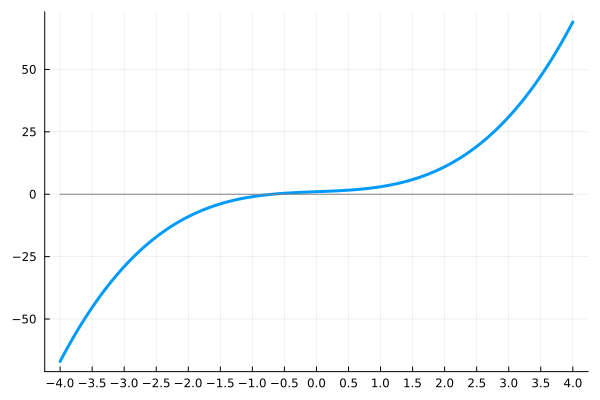
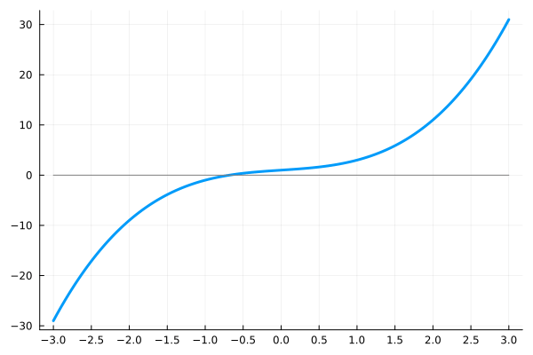
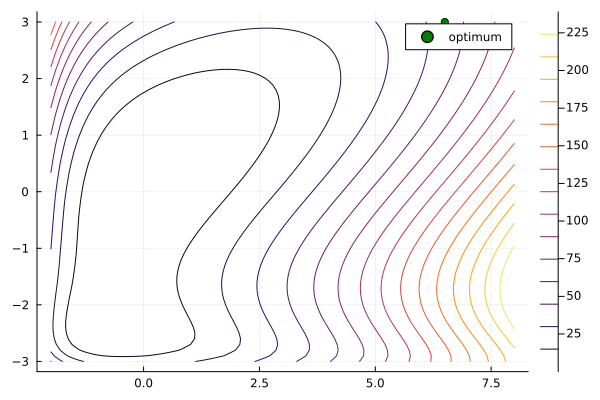
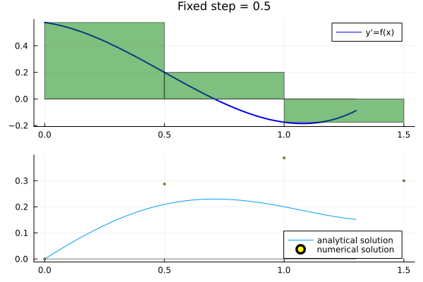
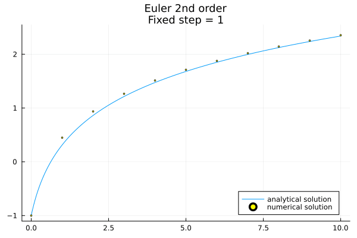
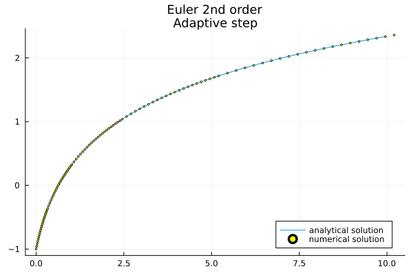

# MiSS repozitorijum

U ovom repozitorijumu se nalaze rešenja zadataka sa računarskih vežbi iz predmeta *Modeliranje i simulacija sistema*. Pored toga repozitorijum sadrži neke lične projekte koji su rađeni tokom semestra, nevezano za gradivo predmeta. Sve je napisano u programskom jeziku [Julia](https://docs.julialang.org), verzija: [1.8.2](https://julialang.org/downloads/oldreleases/).

Za pokretanje Julia fajlova potrebno je otvoriti **REPL** okruženje i instalirati sledeće pakete:

- [Plots v1.35.5](https://docs.juliaplots.org/stable/)
- [DifferentialEquations v7.6.0](https://diffeq.sciml.ai/stable/)
- [ControlSystems v1.5.4](https://juliacontrol.github.io/ControlSystems.jl/dev/)
- [ProgressBars v1.4.1](https://juliapackages.com/p/progressbars)

Ili pokrenuti fajl `install.jl`.

## Literatura i izvori

Svi tekstovi zadatak i materijali sa vežbi se nalaze na sajtu katedre za *[Automatiku](http://www.automatika.ftn.uns.ac.rs/nastavni-materijali-miss)*. Svi direktorijumi unutar direktorijuma `vezbe/` su imenovani istim imenom kao i odgovarajući pdf dokumenti. Takođe, u direktorijumu `skripte/` se nalazi skripta pisana za oblast *Modeli fizičkih sistema*. Skripta je pisana u $\LaTeX$ sistemu.

---

## N-body simulacija

Implementirana jednostavna simulacija sistema sa N čestica. Korišćen Njutnov zakon gravitacije i numerički metod za integraciju Njutnovih jednačina kretanja u klasičnoj mehanici. Pored toga implementirana i detekcija sudara, gde se dve ili više čestica sabija u jednu. Izvorni kod se nalazi u direktorijumu `n_body/`

| 2-body sistem | 3-body sistem |
| :---: | :---: |
|  |  |

| Sistem sa sudarima |
| :---: |
|  |

---

## Numerički algoritmi

Implementirani numerički algoritmi za traženja korena (nula) funkcije, za rešavanje običnih diferencijalnih jednačina i za rešavanje sistema algebarskih jednačina (linearnih i nelinearnih). Izvorni kod se nalazi u direktorijumu `numerical_methods/`

### Metode za traženje nule funkcije

| Metod podele intervala | Njutn-Rapsonov metod |
| :---: | :---: |
|  |  |

### Metode za rešavanje sistema algebarskih jednačina (linearnih i nelinearnih)

|	Gaus-Njutnov metod 	| 	Gradijentni spust 	|
| :---: | :---: |
|  |  |

### Metode za rešavanje ODJ

|	Metoda integracije (Naivan pristup) 	|
| :---: |
|  |

|			Ojlerov metod 			||
| :---: | :---: |
|  |  |
|  |
