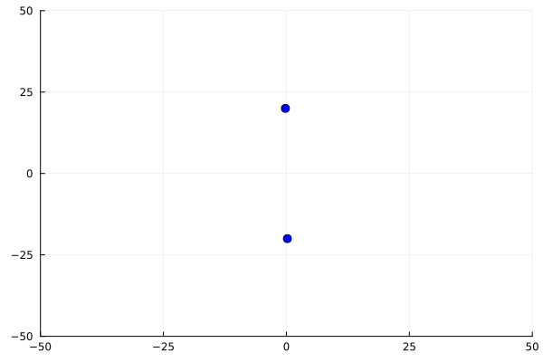
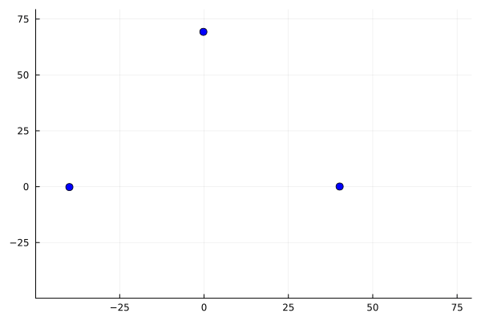

# MiSS repozitorijum

U ovom repozitorijumu se nalaze rešenja zadataka sa vežbi iz predmeta *Modeliranje i simulacija sistema*. \
Pored toga repozitorijum sadrži neke lične projekte koji su rađeni tokom semestra. Sve je napisano u programskom jeziku 
[Julia](https://docs.julialang.org).

## N-body simulacija

2-body sistem | 3-body sistem
:-------------------------:|:-------------------------:
	|	
---
