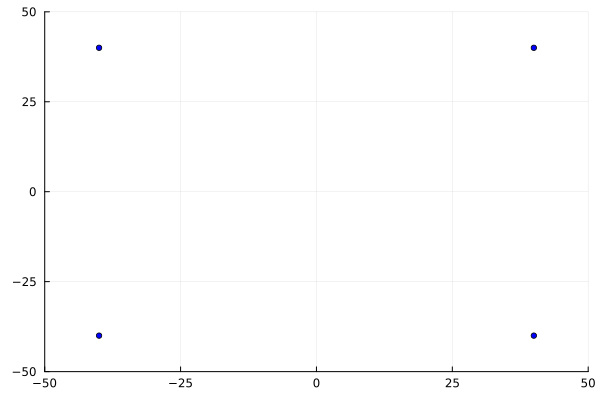

# MiSS repozitorijum

U ovom repozitorijumu se nalaze rešenja zadataka sa računarskih vežbi iz predmeta *Modeliranje i simulacija sistema*. Pored toga repozitorijum sadrži neke lične projekte koji su rađeni tokom semestra, nevezano za gradivo predmeta. Sve je napisano u programskom jeziku [Julia](https://docs.julialang.org).

Za pokretanje Julia fajlova potrebno je otvoriti **REPL** okruženje i instalirati sledeće pakete:

- [Plots](https://docs.juliaplots.org/stable/)
- [DifferentialEquations](https://diffeq.sciml.ai/stable/)
- [ProgressBars](https://juliapackages.com/p/progressbars)

## Literatura i izvori

Svi tekstovi zadatak i materijali sa vežbi se nalaze na sajtu katedre za *[Automatiku](http://www.automatika.ftn.uns.ac.rs/nastavni-materijali-miss)*.

## N-body simulacija

Implementirana jednostavna simulacija sistema sa N čestica. Korišćen Njutnov zakon gravitacije i numerički metod za integraljenje Njutnovih jednačina kretanja u klasičnoj mehanici. Pored toga implementirana i detekcija sudara, gde se dve ili više čestica sabija u jednu.

| 2-body sistem | 3-body sistem |
| :---: | :---: |
|  |  |

| Sistem sa sudarima |
| :---: |
|  |
